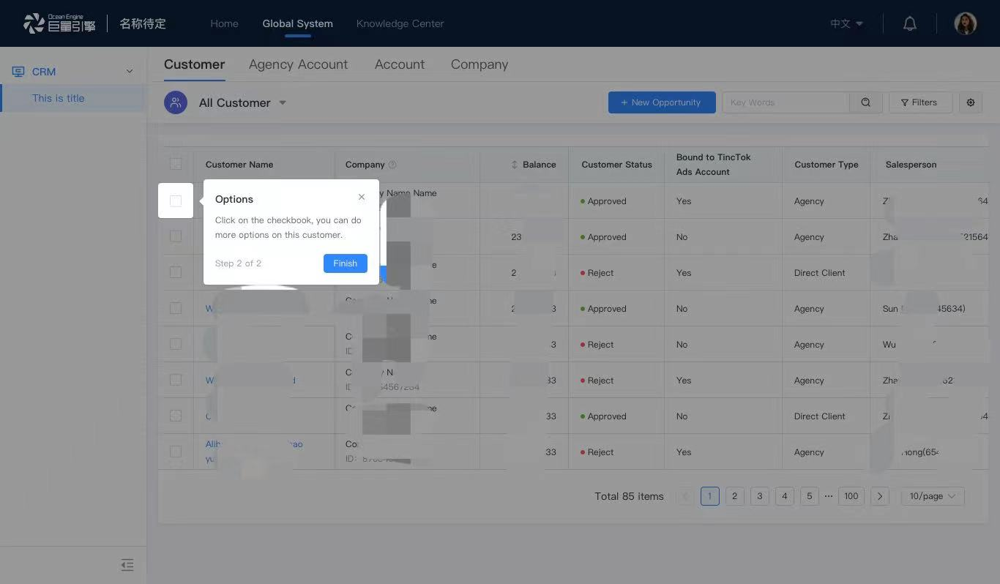

# 使用指南
[English](./README.md) | 简体中文

## 简介
基于react实现的新手引导组件，用于新功能引导，支持带蒙层/不带蒙层两种模式。



## 安装 & 使用

```javascript
/* 安装 npm or yarn */
npm i byte-guide
yarn add byte-guide

/* umd 方式引入 */
<script src='https://unpkg.com/byte-guide/dist/index.umd.min.js'></script>
/* umd 方式引入指定版本 */
<script src='https://unpkg.com/byte-guide@version/dist/index.umd.min.js'></script>

/* 使用 */
import Guide from 'byte-guide'
<Guide
    className='my-guide'
    localKey='uni-key'
    steps={[]}
    onClose={()=> { /* do sth */ }}
    afterStepChange={(nextIndex, nextStep)=> { /* do sth */}}
    stepText={(stepIndex, stepCount) => `第${stepIndex}步，共${stepCount}步`}
    nextText="下一步"
    prevText="上一步"
    showPreviousBtn
    okText='我知道了'
/>
```

## API

### 组件 API

| props            | 含义                                                               | propType                                 | 是否必填 | defalutValue                                                               |
| :--------------- | :----------------------------------------------------------------- | :--------------------------------------- | :------- | :------------------------------------------------------------------------- |
| steps            | 引导步骤，详细配置见下方                                           | array                                    | ✓        | --                                                                         |
| localKey         | 本地缓存 key，缓存是否展示过该引导页，需确保系统内 localKey 唯一性 | string                                   | ✓        | --                                                                         |
| expireDate       | 过期时间，大于等于该时间都不展示引导页                             | string，YYYY-mm-hh                       |          | --                                                                         |
| closable         | 是否可以跳过引导                                                   | bool                                     |          | true                                                                       |
| closeEle       | 自定义跳过引导的元素                                                   | string, reactNode                                     |          |  
| modalClassName   | 弹窗类名                                                           | string                                   |          | --                                                                         |
| maskClassName    | 蒙层类名                                                           | string                                   |          | --                                                                         |
| mask             | 是否展示蒙层                                                       | bool                                     |          | false                                                                      |
| arrow            | 弹窗是否展示箭头                                                   | bool                                     |          | true                                                                       |
| hotspot          | 弹窗是否展示热点                                                   | bool                                     |          | false                                                                      |
| stepText         | modal 的步骤信息文案                                               | (stepIndex, stepCount): string => {}     |          | (stepIndex, stepCount) => { return `第${stepIndex}步，共${stepCount}步`; } |
| nextText         | modal 的'下一步'按钮文案                                           | string                                   |          | 下一步                                                                     |
| prevText         | modal 的'上一步'按钮文案                                           | string                                   |          | 下一步                                                                     |
| showPreviousBtn         | 是否显示'上一步'按钮                                                   | bool                                     |          | true                                                                       |
| okText           | modal 的确认按钮文案                                               | string                                   |          | 我知道了                                                                   |
| visible          | 控制 guide 显示隐藏，用于异步渲染                                  | bool                                     |          | true                                                                       |
| lang             | 多语言                                                             | 'zh' ,'en' , 'ja'                        |          | 'zh'                                                                       |
| step             | 初始步骤，步骤可受控，为-1 则不展示组件                            | number                                   |          | 0                                                                          |
| afterStepChange  | 点击下一步的回调                                                   | (nextIndex, nextStep): void=>{}          |          | --                                                                         |
| beforeStepChange | 点击下一步之前的回调                                               | (stepIndex: number, step: IStep) => void |          | --                                                                         |
| onClose          | 引导结束的回调                                                     | ():void=> {}                             |          | --                                                                         |

### steps

| key              | 含义                                                                                      | propType                                                        | 是否必填                      | 默认值   |
| :--------------- | :---------------------------------------------------------------------------------------- | :-------------------------------------------------------------- | :---------------------------- | :------- |
| selector         | 高亮元素选择器，支持 querySelector 选择器                                                 | string, () => reactNode, reactNode                              |                               | --       |
| targetPos        | 相对于的目标位置，并且首先读取选择器                                                      | object, {top, left, width, height}                              | 必须有 targetPos 和选择器之一 | --       |
| title            | modal 展示标题                                                                            | reactNode                                                       |                               | --       |
| content          | modal 展示描述                                                                            | string, reactNode                                               |                               | --       |
| placement        | modal 的位置，如 bottom-left、left-bottom、bottom 等                                      | string                                                          |                               | 'bottom' |
| offset           | modal 偏移量，可改变 modal 的位置，如 { x: 20, y: 10 }                                    | object                                                          |                               | --       |
| parent           | 父元素节点，元素可被新增到 body，如果 parent 为 null，则会默认被新增到选择器 offsetParent | 'body'or null                                                   |                               | --       |
| visible          | 控制 guide 每个步骤显示隐藏，用于异步渲染                                                 | bool                                                            |                               | true     |
| skip             | 是否跳过该步骤                                                                            | bool                                                            |                               | false    |
| beforeStepChange | 点击下一步之前触发的回调                                                                  | (curStep: IStep, curStepIndex: number, steps: IStep[]) => void; |                               | --       |

steps 示例如下

```javascript
import React from 'react';

const SEARCH = {
  selector: '#search',
  title: '搜索组件',
  content: <div>这个搜索组件很厉害</div>,
  placement: 'bottom-left',
  offset: {
    x: 20,
  },
};

const TOTAL = {
  selector: '#total',
  title: '列表总数',
  content: '这里是列表总数。',
};

const steps = [SEARCH, TOTAL];
```
